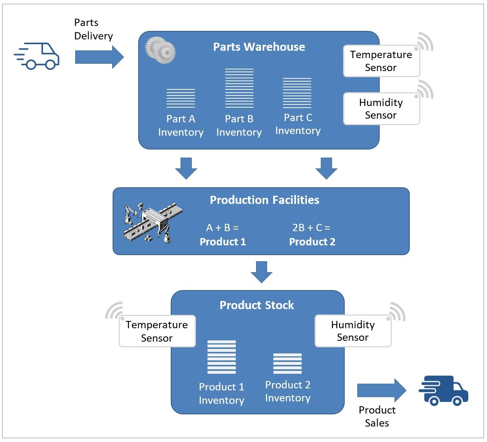

### IoT@VET Project and Smart Factory Training Modules

The project IoT@VET ("Gamification-Based Teaching Materials for IoT Education in VET Schools" | www.iotvet.eu), supported by the EU Erasmus+ funding program, aims to develop digital teaching materials and a gamification-based platform for Internet of Things (IoT) education in vocational education and training (VET) schools.

This repository contains the practical exercise modules developed by GT-ARC in the scope of IoT@VET project, focusing on the smart factory use cases.

The modules were curated by Dr. Fikret Sivrikaya and co-implemented with students at TU Berlin / GT-ARC.

### Smart Factory Scenario

10 training modules in the domain of factories are designed as an interconnected set of hands-on exercises. The individual modules can be developed by different students or student groups in a class to collectively realize a "smart factory" IoT scenario, as depicted in the figure.

- In our scenario, there is a **warehouse**, where different parts are delivered and stored. These parts have specific temperature and humidity requirements for long-term storage. Therefore, sensors are deployed in the warehouse to monitor the environment.
- The **production facilities** in the smart factory include conveyor belts and robotic systems for production. It is also supported by automated systems to pick up and deliver the required parts from the warehouses into the production facilities. For simplification, each product in our scenario is a combination of certain parts, as shown in the figure.
- The **product stock** serves as a warehouse for finished products and facilitates their automated delivery based on sales orders. As in the parts warehouses, the product stock is also equipped with temperature and humidity sensors to ensure proper storage conditions for the products.
- Finally, the smart factory has an automated **inventory tracking system** to monitor the amount of available parts and products in real time. Whenever there is a new delivery of certain parts, the production of a product, or sales and delivery of a product, the inventories are updated accordingly.

The next section provides a summary of the 10 modules within the scenario. 

The first two training modules in this collection are common for all students and aim to set up the common development environment and baseline for the remaining lab sessions.

### Index of Training Modules

1. **Docker as a Virtualization Platform for Cloud and Edge:** This module aims to introduce one of the virtualization concepts, containers, as an enabler of cloud and edge computing. It introduces Docker as a container technology and provides hands-on experience on the creation and management of containerized applications in the Docker environment, focusing on Node-RED as an example application running in Docker. 
    - Getting started with Docker
    - Installing an application as a Docker container 
    - Running & configuring a container/app from an existing local image
2. **Node-RED as an IoT Application Development Tool:** This module aims to provide basic understanding of Node-RED as a visual flow programming tool that can support IoT application design and development.
    - Installing and running Node-RED (as a docker container)
    - "Nodes" and “Flows” in Node-RED
    - Creating your first flow / application in Node-RED
3. **Implementing the Parts Warehouse Sensors:** This module implements simulated temperature and humidity sensors to keep track of the environmental conditions in the parts warehouse.
    - Using the inject and function nodes in Node-RED to create virtual sensors
    - Generating random numbers to emulate sensor data
    - Using an MQTT-out node to send the sensor data to a remote MQTT Broker
